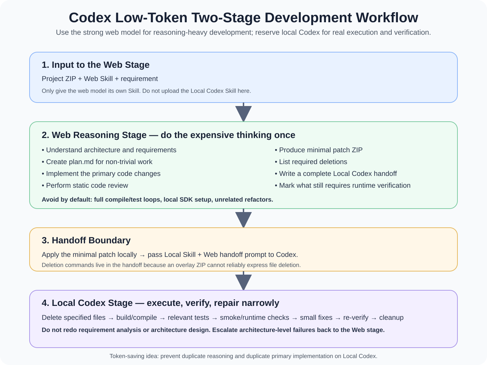

# Codex Low-Token Development Workflow

A reusable AI-assisted development workflow designed to reduce unnecessary **local Codex token / quota usage** by separating reasoning-heavy development from environment-dependent verification.

> **Web reasoning model:** understand the project, analyze requirements, plan, implement the main change, perform static review, and prepare a precise handoff.  
> **Local Codex:** compile, test, run, fix small integration issues, delete obsolete files, and finish.

[繁體中文說明](README.zh-TW.md)



## How to read the diagram

The workflow has one strict boundary: **the web stage owns reasoning-heavy primary development, while local Codex owns environment-dependent execution and narrow finishing work**. The handoff is deliberately explicit so local Codex can start from evidence (build/test/runtime output) instead of rediscovering the requirement.

The diagram also highlights two rules that matter for token efficiency: the Web stage should not spend its time reproducing a full local environment, and Local Codex should not restart architecture analysis unless execution proves that the original design is fundamentally invalid.

## Important terminology note

This repository uses the phrase **"token-efficient"** because it is easy to understand and clearly communicates the goal. However, a product's actual usage limits, quota accounting, or billing may not be calculated only from raw model tokens. This workflow makes **no guarantee of a fixed percentage of savings**.

Its real goal is to reduce duplicated work such as:

- repeated requirement analysis,
- repeated architecture reasoning,
- repeated primary implementation,
- unnecessary large local refactors.

---

## One-Minute Quick Start

### Web stage

Provide only:

```text
your-project.zip
+
skills/web-reasoning/SKILL.md
+
your requirement
```

Suggested instruction:

```text
Follow the uploaded Web Development Skill strictly.

Analyze the project and requirement first.
For non-trivial work, create plan.md before the primary implementation.

After implementation:
1. Perform static code review.
2. Do not run full compile/test cycles unless explicitly required.
3. Produce a minimal patch ZIP.
4. List required file/folder deletions.
5. Produce one complete handoff prompt for local Codex.
```

Expected output:

```text
plan.md
+
minimal patch.zip
+
deletion list
+
local Codex handoff prompt
```

### Local stage

After applying the patch to the local project, provide:

```text
local project
+
skills/local-codex/SKILL.md
+
web-stage handoff prompt
```

Suggested instruction:

```text
Follow the Local Codex Skill and the web-stage handoff.

Do not redo the full requirement analysis or redesign the feature.

Proceed directly with:
- required deletions,
- build/compile,
- relevant tests,
- small integration fixes,
- re-verification,
- cleanup.

If the remaining problem requires architecture-level redesign,
stop expanding the local change and report it back to the web reasoning stage.
```

---

## Do Not Upload the Entire Skill Package to Every Conversation

Repository structure:

```text
codex-low-token-dev-workflow/
├─ README.md
├─ README.zh-TW.md
├─ LICENSE
├─ .gitignore
└─ skills/
   ├─ web-reasoning/
   │  └─ SKILL.md
   └─ local-codex/
      └─ SKILL.md
```

Use:

| Stage | Skill to provide |
|---|---|
| Web reasoning model | `skills/web-reasoning/SKILL.md` |
| Local Codex | `skills/local-codex/SKILL.md` |
| README files | For humans; normally not needed by the model |
| Release ZIP | Download / backup / sharing only |

Keeping the roles separate reduces instruction conflicts.

---

## Full Workflow

```text
Original project ZIP
        │
        ▼
Web reasoning model
+ Web SKILL.md
        │
        ├─ Requirement analysis
        ├─ plan.md
        ├─ Primary implementation
        ├─ Static code review
        ├─ Minimal patch ZIP
        ├─ Deletion list
        └─ Local Codex handoff prompt
        │
        ▼
Apply patch locally
        │
        ▼
Local Codex
+ Local SKILL.md
+ Handoff prompt
        │
        ├─ Required deletions
        ├─ Build / compile
        ├─ Relevant tests
        ├─ Small integration fixes
        ├─ Re-verification
        └─ Cleanup
        │
        ▼
Done
```

---

## Why Two Stages?

The two stages optimize for different strengths.

### Web reasoning stage

Best used for:

- understanding requirements,
- architecture reasoning,
- change planning,
- primary implementation,
- compatibility analysis,
- static code review.

### Local Codex stage

Best used for:

- real project access,
- local SDKs and tools,
- compilation,
- test execution,
- runtime verification,
- evidence-driven small fixes.

The workflow avoids asking both stages to independently perform the same expensive reasoning.

---

## Minimal Patch Strategy

The web stage should return only:

- added files,
- modified files.

A normal overlay ZIP cannot reliably represent file deletion, so deletions must be listed explicitly in the handoff:

```text
[DELETE]
- src/legacy/old-client.ts
- scripts/obsolete/
```

Local Codex performs those deletions.

---

## GitHub Is Optional for the Web Handoff

The web reasoning stage can work from a fixed project ZIP, which may help avoid:

- remote tool-call limitations,
- repository access issues,
- accidental work on the wrong branch or revision.

That does **not** mean Git is unnecessary.

Local Git is strongly recommended for:

- restore points,
- patch safety,
- branches,
- review,
- rollback.

---

## Recommended Safety Before Applying a Patch

Use at least one:

- a local Git commit,
- a temporary branch,
- a full project backup.

---

## Good Fit

This workflow is most useful when:

- the project is medium or large,
- the change requires meaningful reasoning,
- the local environment is already capable of building/testing the project,
- you want to reduce duplicated local Codex reasoning,
- you want a clear boundary between implementation and verification.

It may be unnecessary for very small one-line changes or trivial configuration edits.

---

## Model Names Are Replaceable

The workflow is not fundamentally tied to a specific model name.

Today you might use:

```text
Strong web reasoning model
→ analysis + planning + primary implementation

Local Codex
→ build + test + narrow fixes + finishing
```

If model names change later, the same role split still works.

---

## Language

- English documentation: `README.md`
- Traditional Chinese documentation: `README.zh-TW.md`
- Skills: English only

Keeping the Skills in English gives both stages a single unambiguous instruction set, while the documentation remains fully bilingual for humans.

---

## Disclaimer

This is a community workflow and prompt/skill design.

- It is not an official OpenAI workflow.
- It does not represent official quota or token-saving guarantees.
- Model capabilities, names, limits, and usage accounting may change over time.
- Back up important projects before applying generated patches.
- Production software should still follow your normal code review, testing, security, and deployment requirements.

---

## License

MIT License. See `LICENSE`.
