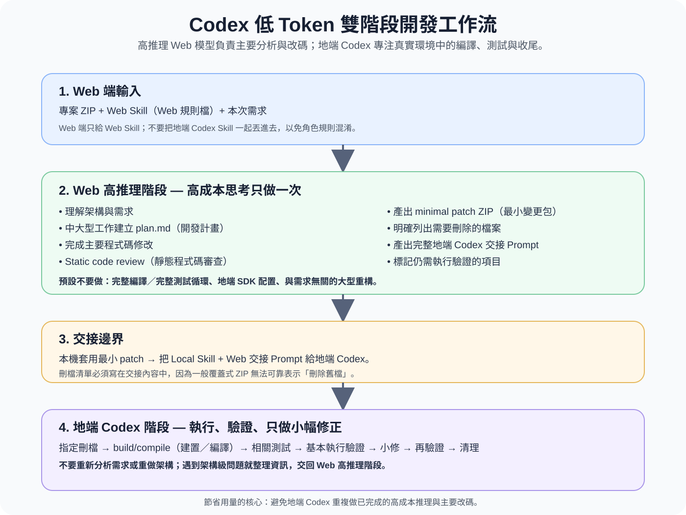

# Codex 低 Token 雙階段開發工作流

這是一套可重複使用的 AI 輔助開發流程，目標是透過明確分工，降低**地端 Codex 的 token／額度用量**，避免同一份需求被 Web 模型與地端 Codex 重複分析、重複設計、重複主要改碼。

> **Web 高推理模型（Web reasoning model）**：負責理解專案、需求分析、開發計畫、主要改碼、靜態程式碼審查，以及整理精準的地端交接內容。  
> **地端 Codex（Local Codex）**：負責實際編譯、測試、執行驗證、小型整合修正、指定刪檔與最後收尾。

---

[English README](README.md)



## 怎麼看這張流程圖？

這套方法最重要的不是「把工作交給比較弱的模型」，而是建立一條很清楚的**責任邊界**：Web 高推理模型負責需要大量理解、判斷與主要改碼的工作；地端 Codex 則從實際的 build／compile（建置／編譯）、test（測試）與 runtime verification（執行階段驗證）結果出發，只做必要的小幅修正與收尾。

這樣做能降低地端 Codex 重複閱讀整個專案、重新分析需求、重新設計架構與重新寫主要功能所造成的額外用量。如果地端實際執行後證明問題已經是 architecture-level issue（架構級問題），就把錯誤、涉及檔案與驗證結果整理好，再交回 Web 高推理模型，而不是讓地端無限制擴大改碼。

## 先說明：這裡的「Token」是什麼意思？

`Token`（權杖／模型處理文字時使用的基本計量單位）常被用來泛指模型的使用量。

不過不同產品的：

- 額度限制（quota）
- 使用量計算
- 計費方式
- 模型資源配額

**不一定只由原始 token 數量決定。**

因此本專案名稱使用 **Low-Token（低 token 用量）**，是為了直接表達「盡量降低不必要的地端 Codex 使用量」這個目標，並不代表官方額度一定只按 token 計算，也不保證固定能節省多少百分比。

真正想降低的是以下重複成本：

- 重複需求分析
- 重複架構推理
- 重複建立開發計畫
- 重複主要改碼
- 地端不必要的大型重構

---

# 一分鐘快速開始

## 第一階段：Web 端

只需要提供：

```text
你的專案.zip
+
skills/web-reasoning/SKILL.md
+
你的需求
```

建議對 Web 模型說：

```text
請嚴格遵守我上傳的 Web Development Skill（Web 開發規則）。

先分析專案與需求。
中大型修改先建立 plan.md（開發計畫文件）。

主要改碼完成後：
1. 進行 static code review（靜態程式碼審查）
2. 除非必要，不要做完整 compile（編譯）
3. 除非必要，不要跑完整 test suite（完整測試集合）
4. 產出 minimal patch ZIP（最小變更覆蓋壓縮檔）
5. 列出需要刪除的檔案或資料夾
6. 產出一段完整的 local Codex handoff prompt（地端 Codex 交接提示詞）
```

Web 最後應交付：

```text
plan.md
+
最小 patch.zip
+
刪檔清單
+
地端 Codex 交接 Prompt
```

---

## 第二階段：地端 Codex

先把 Web 產生的 patch（變更覆蓋包）套用到本機專案。

接著提供：

```text
本機專案
+
skills/local-codex/SKILL.md
+
Web 交接 Prompt
```

建議對地端 Codex 說：

```text
請嚴格遵守 Local Codex Skill（地端 Codex 規則）
以及 Web 端提供的交接 Prompt。

不要重新做完整需求分析，
也不要重新設計整套功能。

直接執行：
- 指定刪檔
- build / compile（建置／編譯）
- 相關測試
- 小型整合修正
- 再次驗證
- 清理與收尾

如果剩餘問題已經需要 architecture-level redesign（架構級重新設計），
請停止擴大地端修改並回報，不要在地端重新開發整套功能。
```

---

# 最重要：不要每次把整包 Skill 全部丟進同一個對話

GitHub 專案結構：

```text
codex-low-token-dev-workflow/
├─ README.md
├─ README.zh-TW.md
├─ LICENSE
├─ .gitignore
└─ skills/
   ├─ web-reasoning/
   │  └─ SKILL.md
   └─ local-codex/
      └─ SKILL.md
```

實際使用：

| 使用位置 | 要提供的檔案 |
|---|---|
| Web 高推理模型 | `skills/web-reasoning/SKILL.md` |
| 地端 Codex | `skills/local-codex/SKILL.md` |
| `README.md` / `README.zh-TW.md` | 給人閱讀，通常不用交給模型 |
| Release ZIP | 只用於下載、備份、分享 |

如果 Web 端同時讀到地端 Skill，或地端同時讀到 Web Skill，模型可能混淆自己的責任。

所以核心原則是：

> **每一端只拿自己的 Skill。**

---

# 完整流程

```text
原始專案 ZIP
     │
     ▼
Web 高推理模型
+ Web SKILL.md
     │
     ├─ 需求分析
     ├─ plan.md
     ├─ 主要改碼
     ├─ static code review
     │  （靜態程式碼審查）
     ├─ minimal patch ZIP
     │  （最小變更覆蓋包）
     ├─ 刪檔清單
     └─ handoff prompt
        （地端交接提示詞）
     │
     ▼
將 patch 套用到本機
     │
     ▼
地端 Codex
+ Local SKILL.md
+ Web 交接 Prompt
     │
     ├─ 指定刪檔
     ├─ build / compile
     │  （建置／編譯）
     ├─ test
     │  （測試）
     ├─ runtime verification
     │  （執行階段驗證）
     ├─ 小型修正
     ├─ 再驗證
     └─ 收尾
     │
     ▼
完成
```

---

# Web 端負責什麼？

Web Skill：

```text
skills/web-reasoning/SKILL.md
```

Web 端負責高推理、高價值工作：

- 理解完整專案
- 找出主要進入點
- 理解架構
- 分析需求
- 建立 `plan.md`
- 決定修改策略
- 分析影響範圍
- 完成主要程式碼修改
- 進行 static code review（靜態程式碼審查）
- 檢查相容性
- 產生 minimal patch（最小變更覆蓋包）
- 列出需要刪除的檔案
- 整理 local Codex handoff prompt（地端交接提示詞）

除非使用者特別要求，Web 端不應把大量資源花在：

- 完整編譯
- 完整測試
- 地端 SDK（軟體開發套件）安裝
- 本機環境排錯
- 外部服務啟動
- 大量 runtime verification（執行階段驗證）

這些工作交給地端更合理。

---

# 地端 Codex 負責什麼？

Local Skill：

```text
skills/local-codex/SKILL.md
```

地端負責真實環境中的驗證與收尾：

- 確認 patch 套用正確
- 刪除 Web 指定的舊檔案
- 補齊必要依賴
- build（建置）
- compile（編譯）
- type checking（型別檢查）
- test（測試）
- smoke test（基本啟動檢查）
- runtime verification（實際執行驗證）
- 修正小型整合問題
- 重新驗證
- 清理本次產生的暫存內容
- 最後回報結果

地端不應重新做：

- 完整產品需求分析
- 另一份完整 plan
- 新架構設計
- 不必要的大型 refactor（重構）
- 與本次需求無關的 cleanup（整理）

---

# 什麼叫「小型修正」？

適合地端直接處理：

- import（匯入）錯誤
- 型別錯誤
- 路徑錯誤
- 少傳參數
- 小型 API（應用程式介面）對接錯誤
- 環境變數名稱錯誤
- 漏掉必要設定
- 小型測試資料問題
- 小型 build configuration（建置設定）錯誤

不適合地端自行擴大處理：

- 主要架構需要重做
- 核心資料模型需要重做
- public API（公開程式介面）需要大幅改變
- 主要模組需要大量重寫
- 要換 framework（框架）
- 要做大型 dependency migration（依賴套件遷移）

遇到這類問題，應該把問題整理後交回 Web 高推理模型。

---

# 為什麼這樣比較省地端 Codex 用量？

最容易浪費地端 Codex 用量的情況，不一定是「編譯」本身，而是地端又重新做一次：

```text
重新理解整個專案
→ 重新分析需求
→ 重新想架構
→ 重新產生一套修改方案
→ 再開始改碼
```

如果這些事情 Web 端已經完成一次，就不需要讓地端完整再做一次。

因此本流程強調：

```text
Web：
負責「想清楚 + 主要改好」

Local Codex：
負責「真的跑 + 根據錯誤小修 + 驗證完成」
```

---

# 最小 Patch 策略

`Patch`（差異／變更覆蓋包）只應包含：

- 新增檔案
- 修改檔案

不要把整個專案重新打包當成 patch。

例如：

```text
src/
  api/
    client.ts
```

如果只有 `client.ts` 被修改，patch 就只需要包含它與必要的新檔案。

---

# 為什麼刪檔要另外列？

一般 overlay ZIP（覆蓋式壓縮檔）只會：

- 新增檔案
- 覆蓋檔案

它不會可靠表達：

> 「這個原本存在的檔案現在應該消失。」

所以 Web 必須明確輸出：

```text
[DELETE]
- src/legacy/old-client.ts
- scripts/obsolete/
```

再交給地端 Codex 執行刪除。

---

# 一定要用 GitHub 嗎？

不一定。

Web 端可以直接使用固定版本的完整專案 ZIP，可能有這些好處：

- 不依賴 Web 模型操作 GitHub
- 避免遠端工具呼叫限制
- 容易確認 Web 看到的是哪一版程式
- 避免抓到錯誤 branch（分支）
- patch 比較容易搬回本機

但是：

> **不用 GitHub 傳程式給 Web，不代表不要用 Git。**

本機仍然非常建議使用 Git（版本控制系統）。

---

# 套 Patch 前的保護措施

至少做一種：

- 建立本機 Git commit（版本提交）
- 建立新的 branch（分支）
- 複製完整專案備份

如果 patch 有問題，就能快速回復。

---

# 適合哪些專案？

比較適合：

- 中型以上專案
- 需求需要較多推理
- Web 高推理模型主要改碼品質較高
- 地端已經有完整開發環境
- 想減少地端 Codex 重複推理
- 想把「主要開發」與「實際驗證」清楚拆開

比較不一定需要：

- 只改一兩行
- 單純文字修改
- 很小的 bug
- 完全不需要編譯或測試的工作

---

# Skill 為什麼全部改成英文？

公開版的兩份 Skill 都使用英文：

```text
skills/web-reasoning/SKILL.md
skills/local-codex/SKILL.md
```

原因不是中文不能用，而是希望：

- Web 與地端使用完全一致的技術措辭
- 減少中英文專有名詞混用造成的規則歧義
- 方便國際使用者直接使用
- README 可以負責把概念完整翻譯成人類容易理解的中文

所以：

> **Skill 給模型看，用英文。**  
> **README 給人看，同時提供完整英文與完整繁體中文。**

---

# 模型名稱以後改了怎麼辦？

這套流程不應綁死特定模型名稱。

真正重要的是角色：

```text
高推理 Web 模型
→ 需求分析 + 計畫 + 主要改碼

地端 Codex
→ 編譯 + 測試 + 小型修正 + 收尾
```

未來即使 Sol、Luna 或其他模型名稱改變，只要角色分工不變，工作流仍然可以沿用。

---

# 語言版本

- 英文完整說明：`README.md`
- 繁體中文完整說明：`README.zh-TW.md`
- Web Skill：英文
- Local Codex Skill：英文

---

# 非官方聲明

這是一套社群整理的開發工作流與 Prompt / Skill 規則。

- 不是 OpenAI 官方工作流
- 不代表官方 token、額度或計費節省保證
- 不保證固定節省比例
- 模型能力、名稱、產品限制、額度計算方式可能改變
- 套用 AI 產生的 patch 前應自行備份重要專案
- 正式產品仍應依照團隊既有的 Code Review（程式碼審查）、測試、安全與部署規範執行

---

# 授權

本專案使用 MIT License（MIT 開放原始碼授權）。

允許自由：

- 使用
- 複製
- 修改
- 散布
- 再發布

詳細條款請查看 `LICENSE`。

---

# 一句話版本

```text
Web：
專案 ZIP + Web Skill + 需求
→ 分析 → plan → 主要改碼 → 靜態審查 → patch + 地端交接

地端 Codex：
修改後專案 + Local Skill + Web 交接
→ 編譯 → 測試 → 小修 → 再驗證 → 收尾
```

> **目標不是讓較弱模型做完整開發，而是避免地端 Codex 重複做 Web 已經完成的高成本推理。**
